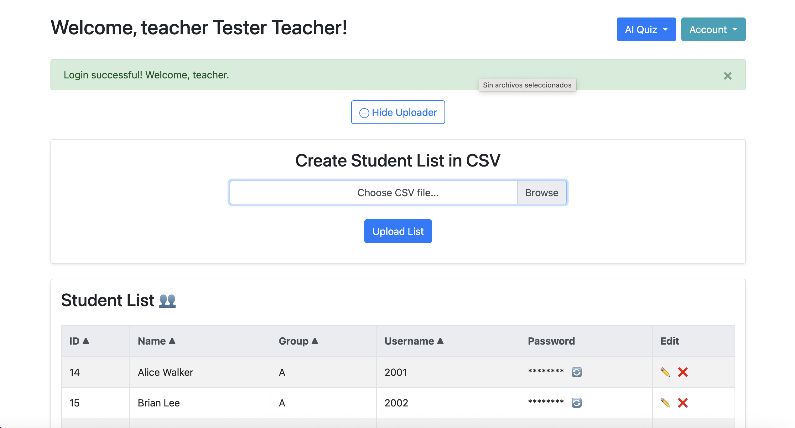
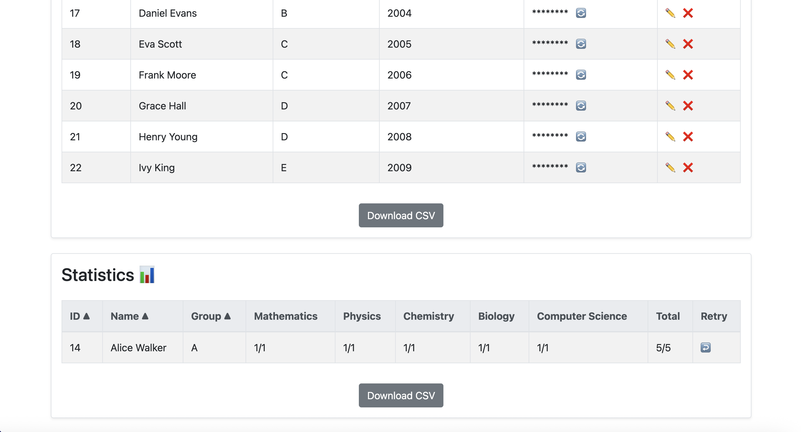
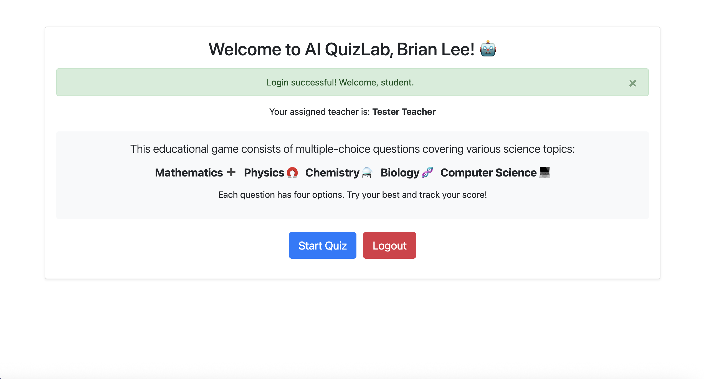
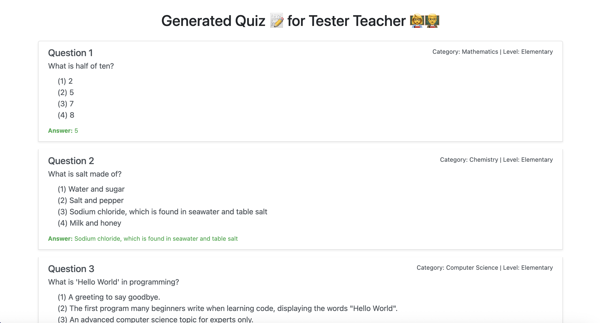

# User Guide 👥

Complete guide for teachers and students using AI QuizLab.

## Teacher Workflow 🧑‍🏫

### Getting Started

1. **Registration & Login**
   - Register as a new teacher
   - Login with your credentials
   - Access the teacher dashboard


### Student Management

#### Upload Student Lists
1. **Prepare CSV file** with format:
   ```csv
   exp,name,group
   2001,Alice Walker,A
   2002,Brian Lee,A
   2003,Carol Smith,B
   ```

2. **Upload Process**:
   - Click "Choose File" in Upload section
   - Select your CSV file
   - Click "Upload List"
   - Automatic password generation
   - Download credentials CSV



#### Manage Students
- **Edit**: Click ✏️ to modify name/group
- **Delete**: Click ❌ (only if no quiz taken)
- **Reset Password**: Click 🔄 to generate new password

### Quiz Creation

#### Choose Question Sources
For each subject category, you can:
- **📚 Use Question Bank**: Pre-built questions from database
- **🤖 Use AI Generation**: Dynamic questions created by Ollama


#### Configuration Options
- **Categories**: Mathematics, Physics, Chemistry, Biology, Computer Science
- **Difficulty Levels**: Elementary, Middle School, High School  
- **Question Count**: 0-25 questions per category
- **Mixed Sources**: Combine AI and bank questions

#### Creation Process
1. Set number of questions per category
2. Select difficulty levels
3. Toggle AI checkboxes as needed
4. Click "Create Quiz"
5. Wait for generation (AI takes longer)
6. View generated quiz

### Results & Analytics

#### View Student Performance
- Individual scores by subject
- Total quiz performance
- Group-based analytics
- Export results to CSV



#### Student Management
- **Retry Quiz**: Allow students to retake (resets previous results)
- **Download Data**: Export all results as CSV

### Profile Management
- Update name and school information
- Change password securely
- View account details

## Student Workflow 👨‍🎓

### Getting Started

1. **Receive Credentials**
   - Get username/password from teacher
   - Login at application URL
   - Access student dashboard



### Taking Quizzes

#### Quiz Interface
1. **Start Quiz**: Click "Start Quiz" button
2. **Answer Questions**: Select one option per question
3. **Question Types**: Multiple choice (A, B, C, D)
4. **Categories**: Mixed science subjects
5. **Submit**: Complete all questions and submit



#### Quiz Rules
- **One Attempt**: Cannot retake unless teacher allows
- **All Questions Required**: Must answer all to submit
- **Time Limit**: No time restrictions
- **Results**: Immediate feedback after submission

#### Results View
- Scores by subject category
- Total performance
- Cannot retake (unless reset by teacher)

## Common Workflows

### Daily Class Scenario
1. **Teacher Preparation**:
   - Upload student list (once per class)
   - Create subject-specific quiz
   - Share credentials with students

2. **Class Execution**:
   - Students login and take quiz
   - Teacher monitors progress
   - Review results together

3. **Follow-up**:
   - Analyze performance data
   - Reset quiz for struggling students
   - Export results for records

### Exam Preparation
1. **Mixed Difficulty**: Create quizzes with various levels
2. **AI Questions**: Use AI for fresh, unique questions
3. **Practice Rounds**: Allow retakes for practice
4. **Performance Tracking**: Monitor improvement over time

## Best Practices

### For Teachers
- **CSV Format**: Always verify CSV format before upload
- **Password Security**: Download and securely share credentials
- **Quiz Planning**: Plan question distribution across subjects
- **Regular Backups**: Export results regularly

### For Students  
- **Single Session**: Complete quiz in one sitting
- **Careful Reading**: Read questions thoroughly
- **No Guessing**: Think through each answer
- **Technical Issues**: Report problems immediately

## Tips & Tricks

### Efficient Student Management
- Use consistent naming in CSV files
- Group students logically (by class/section)
- Keep backup of credentials CSV

### Optimal Quiz Creation
- **Balanced Distribution**: Mix easy and hard questions
- **Subject Variety**: Include multiple science areas
- **AI vs Bank**: Use AI for novel questions, bank for tested content

### Performance Analysis
- Compare results across different difficulty levels
- Identify weak subject areas
- Track individual student progress

## Next Steps

📝 Need technical details? → [API Reference](api-reference.md)
🤖 Want to configure AI? → [AI Integration](ai-integration.md)
❓ Having problems? → [Troubleshooting](troubleshooting.md)